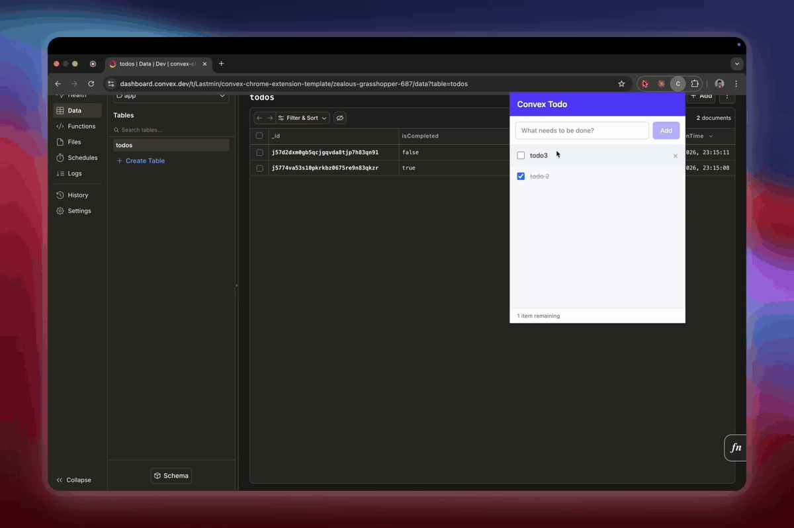

# convex-chrome-extension-template

> A minimal, real-time Chrome extension powered by [Convex](https://convex.dev) — real-time backend with zero server setup.



[](LICENSE)
[](https://convex.dev)
[](https://developer.chrome.com/docs/extensions/mv3/)

---

## What's inside

- **Chrome MV3 popup** — `manifest.json` + `index.html` wired to a React app via `@crxjs/vite-plugin`
- **Convex backend** — `schema.ts` with a todos table, `todos.ts` with `list`, `add`, `toggle`, `remove` functions
- **React frontend** — `ConvexProvider` in `main.tsx`, `useQuery` + `useMutation` calls in `App.tsx`
- **Tailwind CSS v4** — zero-config via `@tailwindcss/vite`
- **Parallel dev** — `npm run dev` runs `convex dev` and `vite` together via `npm-run-all`

## Stack

| Layer     | Technology                                               |
| --------- | -------------------------------------------------------- |
| Extension | Chrome MV3, [`@crxjs/vite-plugin`](https://crxjs.dev)   |
| Frontend  | React 18, TypeScript, Tailwind CSS v4, Vite 6            |
| Backend   | [Convex](https://convex.dev) (database + functions + WS) |

## Prerequisites

- Node.js 18+
- A free [Convex account](https://dashboard.convex.dev)

## Quick start

```bash
git clone https://github.com/jashwanth0712/convex-chrome-extension-template.git
cd convex-chrome-extension-template
npm install
npm run dev
```

On first run, `convex dev` prompts you to log in and create a project. It writes `VITE_CONVEX_URL` to `.env.local` automatically.

**Load in Chrome:** `chrome://extensions/` → Enable Developer mode → Load unpacked → select `dist/`

## Project structure

```
convex-chrome-extension-template/
├── manifest.json        # Chrome MV3 manifest
├── index.html           # Popup entry point
├── vite.config.ts
├── src/
│   ├── main.tsx         # ConvexProvider setup
│   └── App.tsx          # UI + useQuery / useMutation
└── convex/
    ├── schema.ts        # Database schema
    └── todos.ts         # Backend functions
```

## How it works

Backend is two files and four functions (`list`, `add`, `toggle`, `remove`). The entire frontend data layer:

```tsx
const todos      = useQuery(api.todos.list);     // live WebSocket subscription
const addTodo    = useMutation(api.todos.add);
const toggleTodo = useMutation(api.todos.toggle);
const removeTodo = useMutation(api.todos.remove);
```

`useQuery` subscribes automatically — change a todo from the dashboard, another browser, or a separate app and the popup updates instantly with no extra code.

## Scripts

| Command             | Description                                    |
| ------------------- | ---------------------------------------------- |
| `npm run dev`       | Run Convex backend + Vite frontend in parallel  |
| `npm run build`     | Production build to `dist/`                    |

---

## Full guide

A complete step-by-step walkthrough of how this was built — from project setup to real-time sync — is in **[blog/guide.md](blog/guide.md)**.

---

## Contributing

Issues and PRs are welcome. For significant changes, open an issue first.

## License

[MIT](LICENSE)
